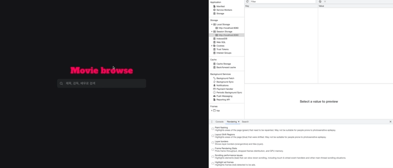

# 프로젝트 소개 💡
🎬 바닐라 자바스크립트를 이용하여 구현된 영화 자동 검색기 입니다.

## 프로젝트 실행 방법 🔧
```
npm install

npm start
```

<br/>

## 기술 스택 🦾
- TypeScript
- Webpack
- Babel
- ES Lint
- Prettier

<br/>

## 주요 기능 및 페이지 소개 ⚙️

<table>
  <tr>
    <td>사이트 동작 화면</td>
    <td>API 캐싱 화면</td>
  </tr>
  <tr>
    <td>
      
    </td>
    <td>
      
    </td>
  </tr>
  <tr>
    <td colspan="2">
      <b>주요 기능</b>
    </td>
  </tr>
  <tr>
    <td colsan="2">
      <li>API 호출로 받은 영화 리스트 데이터 표시</li>
      <li>한번 받아온 API 데이터 캐싱 처리</li>
      <li>방향키 이동으로 아이템 선택 처리</li>
      <li>빈값인 경우, API 호출 방지</li>
      <li>API 호출 debounce처리</li>
      <li>Input clear 기능</li>
      <li>Input blur 시, 리스트 닫기 기능</li>
    </td>
  </tr>
</table>

<br/>

## 디렉토리 구조 📂
<details markdown="1">
<summary>자세히 보기</summary>

```
.
├── README.md
├── package-lock.json
├── package.json
├── public
│   ├── Favicon.ico
│   └── index.html
├── src
│   ├── App.module.scss
│   ├── App.ts
│   ├── api
│   │   ├── index.ts
│   │   └── types.ts
│   ├── assets
│   │   ├── images
│   │   │   ├── icon-close.svg
│   │   │   ├── icon-search.svg
│   │   │   └── image-logo.svg
│   │   └── styles
│   │       ├── index.scss
│   │       └── variables.scss
│   ├── components
│   │   ├── base
│   │   │   ├── Input
│   │   │   │   ├── index.ts
│   │   │   │   └── types.ts
│   │   │   └── index.ts
│   │   ├── core
│   │   │   ├── Component.ts
│   │   │   └── index.ts
│   │   ├── domain
│   │   │   ├── index.ts
│   │   │   └── search
│   │   │       ├── SearchInput
│   │   │       │   ├── SearchInput.module.scss
│   │   │       │   ├── index.ts
│   │   │       │   └── types.ts
│   │   │       ├── SearchResultList
│   │   │       │   ├── SearchResult.module.scss
│   │   │       │   ├── index.ts
│   │   │       │   └── types.ts
│   │   │       └── index.ts
│   │   └── index.ts
│   ├── data
│   │   ├── constants
│   │   │   ├── api.ts
│   │   │   ├── images.ts
│   │   │   └── index.ts
│   │   └── models
│   │       ├── declarations.d.ts
│   │       ├── index.ts
│   │       └── types.ts
│   ├── main.ts
│   ├── services
│   │   ├── index.ts
│   │   └── movie.ts
│   └── utils
│       ├── dom
│       │   ├── index.ts
│       │   └── types.ts
│       ├── helpers
│       │   ├── index.ts
│       │   └── types.ts
│       ├── index.ts
│       └── storage
│           └── index.ts
├── tsconfig.json
├── tsconfig.path.json
└── webpack.config.js
```

</details>

- `/.github`: 깃허브 관련 디렉토리
  - README.md 파일의 프로젝트 소개 이미지

- `/.api`: API Request 관련 디렉토리
  - `/index.ts`: service에서 호출되는 API 함수

- `/.assets`: 이미지, 스타일 관련 디렉토리

- `/components`: App에서 사용되는 컴포넌트 관련 디렉토리
  - `/core`: 컴포넌트들의 기본 구조가 되는 컴포넌트
  - `/base`: domain에서 사용되는 최소 단위의 컴포넌트
  - `/domain`: 해당 도메인에서만 사용되는 컴포넌트

- `/data`: 타입과 상수 관련 디렉토리
  - `/constants`: 프로젝트 전역에서 사용되는 상수
  - `/models`: 프로젝트 전역에서 사용되는 타입

- `/service`: api 데이터를 가공하는 함수관련 디렉토리

- `/utils`: 유틸함수 관련 디렉토리

### 컴포넌트 구조 🛠
- `index.ts`: types와 styled를 이용하여 구현한 컴포넌트
- `types.ts`: 해당 컴포넌트의 type들이 정의되어 있는 컴포넌트

<br/>

## Core 컴포넌트 Data Model ✅
```
interface Component<StateType> {
  node: Element
  state: StateType
  preventRenderStateKey: Set<string>
  needRender: boolean
  needUpdate: boolean
  subscribers: Set<any>
}
```
<br/>

## Core 컴포넌트 구조 ⚙️
- **컴포넌트 데이터**
  - **`node`**: 컴포넌트의 node
  - **`initalState`**: 컴포넌트 상태의 초기값
  - **`preventRenderStateKey`**: 구독중인 컴포넌트의 상태 변경 시, 내부적으로 상태만 업데이트 후 자식 컴포넌트만 렌더링하기 위한 key
  - **`needRender`**: 컴포넌트의 상태 변경에 따른 렌더링 여부
  - **`needUpdate`**: 컴포넌트의 상태 변경에 따른 setState 여부
  - **`subscribers`**: 컴포넌트 상태 변경 시, 상태가 같이 변경될 하위 컴포넌트
- **컴포넌트 메서드**
  - **`template()`**: 컴포넌트의 markup을 반환하는 메서드
  - **`init()`**: 렌더링 전, 내부적으로 사용될 변수, 함수 정의 또는 초기 데이터를 받아올 때 사용되는 라이프사이클 메서드
  - **`fetch()`**: 초기 렌더링 이후 컴포넌트의 fetching이 필요할 때 실행되는 라이프 사이클 메서드
  - **`render()`**: 빈 태그를 컴포넌트의 markup으로 변환, 이벤트를 바인딩, 하위 컴포넌트를 부착을 하는 라이프 사이클 메서드
  - **`update()`**: 상태 변경 시, 렌더링을 위한 라이프사이클 메서드
  - **`updateChildren()`**: 상태 변경 시, 하위 컴포넌트의 렌더링을 위한 라이프 사이클 메서드
  - **`attachChildComponent()`**: 하위 컴포넌트를 상위 컴포넌트의 template과 연결하는 라이프 사이클 메서드
  - **`subscribe()`**: 상위 컴포넌트에 구독을 하는 메서드
  - **`validationState`**: 컴포넌트의 상태 변경 시, 현재 컴포넌트가 가지고 있는 상태인지 판별하는 메서드
  - **`setState()`**: 컴포넌트의 상태 변경 시, 컴포넌트의 상태를 업데이트, 하위 컴포넌트들에게 알리는 메서드
  - **`notify()`**: 상위 컴포넌트로부터 받은 새로운 상태로 하위 컴포넌트들의 setState(), render()하게 해주는 메소드
  - **`setEvent()`**: 컴포넌트의 node에 이벤트를 바인딩하는 라이프 사이클 메서드
  - **`clearEvent()`**: 컴포넌트의 node에 바인딩되어 있는 이벤트를 지우는 라이프 사이클 메서드